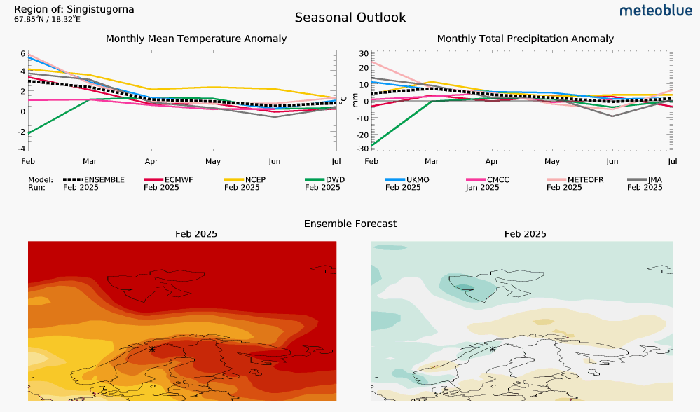
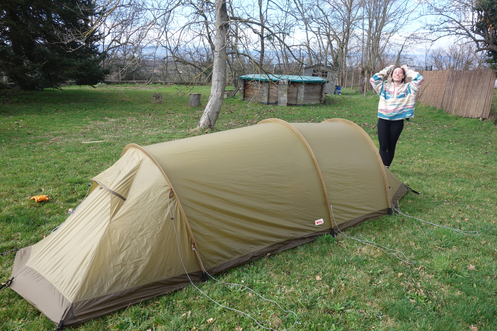
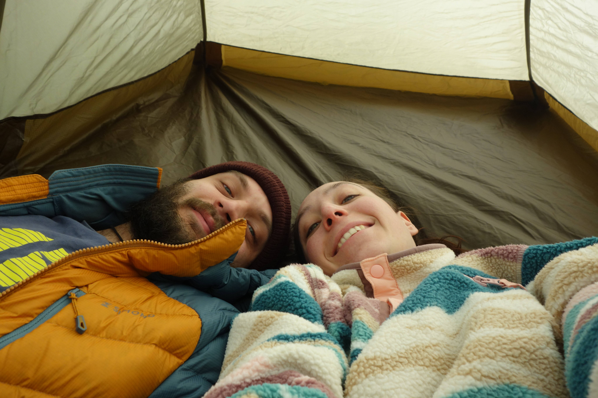
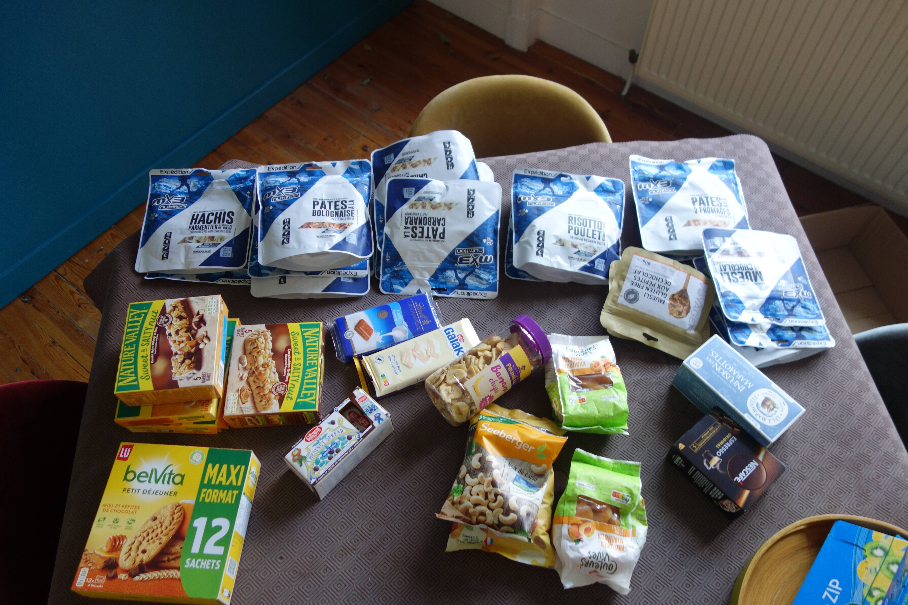
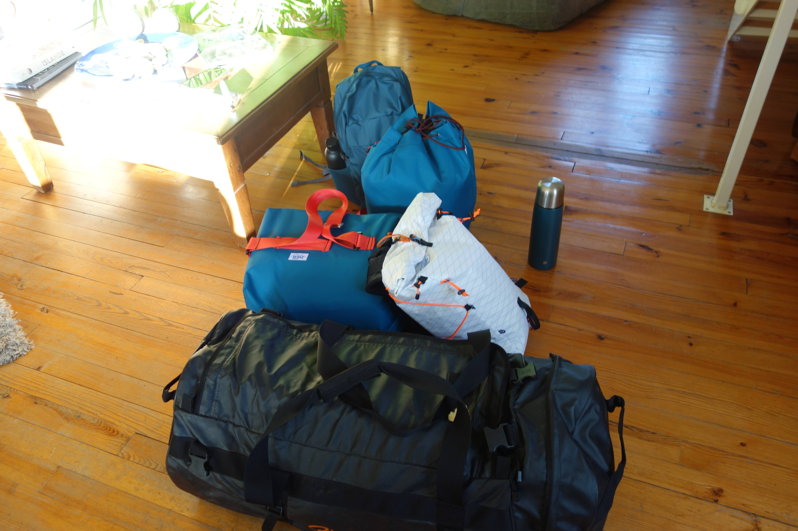

Départ dans moins de 24 heures ! Et les deux dernières semaines ont été hautes en couleur, avec pas mal de changements par rapport au plan initial qui seront détaillés ici

## Bilan météo à J-1

Il y a quelques jours, nous hésitions encore à partir. Le climat local est devenu extrêmement chaud pour la saisons, avec des températures moyennes plus haute de 6°C par rapport aux normales de saison. L'impact du réchauffement climatique est drastique dans la région balayée par les souffles océaniques, comme le montre ce météogramme :

Ces températures positives étaient accompagnées d'images assez effrayantes d'un reportage local, dont voici une capture d'écran:

C'est le vallon de Vistas, où nous devions initialement passer...

Après pas mal de discussions, nous avons finalement décidé de partir quand même. Après tout, nous avons nos billets ! J'ai pu avoir des nouvelles de la station STF d'Abisko, dont les informations étaient un peu rassurantes:

> It is quite mild weather in Abisko right now.
> The temperatures are going to drop again next week but there is not too much new snow coming.
> That is actually quite common because Abisko lies in the precipitation shadow of the closest mountain range.
> 
>Information about conditions at North Kungsleden from STF mountain cabin hosts, 20-februari:
>North Kungsleden from Abisko towards Kebnekaise is fine. Stretches over lakes where wind transported snow away can be slippery. Could be good with spikes if you have pulka to carry your skis on.
>Singi to Kebnekaise gets icier and spikes could be good option there too.
>The last stretch between Kebnekaise and Nikkaluokta has unfortunately almost no snow at the moment.
>
>I think the trip is doable if you can somehow carry your skis the last part of the trip.

En somme, la fin est compliquée mais la section Abisko -> Singi reste praticable, bien que bien glacée.

## Changement de trace

Afin de s'adapter aux mauvaises conditions de neige pour profiter pleinement de notre voyage, nous avons modifié notre trace, pour réaliser une sorte d'aller-retour depuis Abisko. Nous allons suivre la Kungsleden jusqu'à Salka, puis remonter NNE vers Nallo pour finalement passer le col direction NNO et atterir à Tjaktja. De là, nous reprendrons la Kungsleden en sens inverse direction Abisko.

Voici la trace GPX de l'itinéraire mis à jour: _TBD_

## Derniers tests, entretiens, etc.

Ce dernier jour avant le départ était l'occasion parfaite pour monter la nouvelle tente, et tester le réchaud:

 

Nous avons également consacré une bonne partie de la journée à l'empaquettement de la nourriture et la répartition des affaires dans les sacs. Pas une mince affaire, mais nous avons réussi à tout faire rentrer !

 

Le sac noir, qui ira en soute, pèse 21kg. Les deux sacs bleus pour la cabine pèsent chacun 4,5kg, et nos petits sacs à dos sont assez légers.

## Changements de dernière minute

Pour ma part, j'ai fait quelques petits ajustements concernant mon matériel perso. À cause des températures plutôt clémentes en prévision
- quelques changements sur les habits (une polaire en moins, pas de chapka)
- J'ai souvent froid aux fesses, donc il me faudrait un second matelas. Plutot que full Therm-a-rest Z-lite (410g) prévu intialement, forclaz acheté 12€ sur LBC coupé en deux pour pour n'avoir plus que 75cm et 175g
